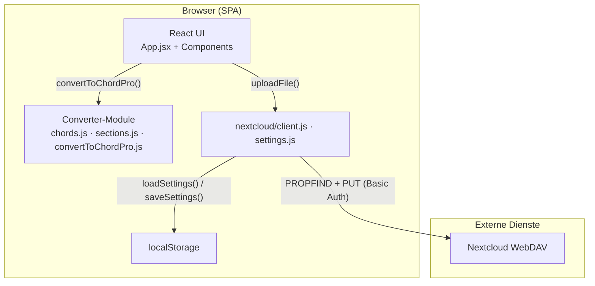
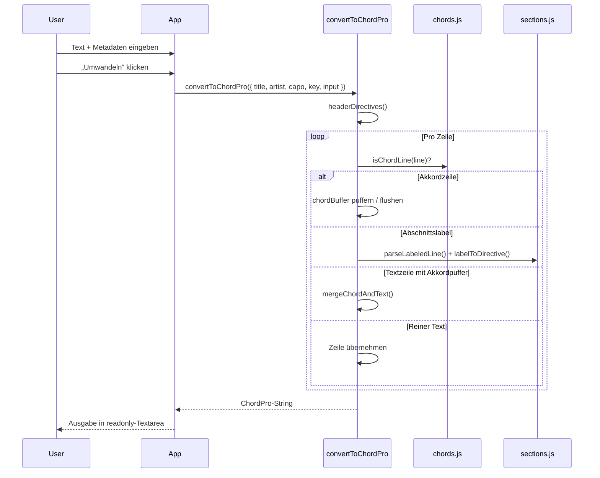
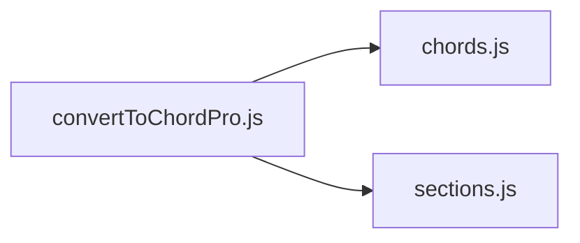
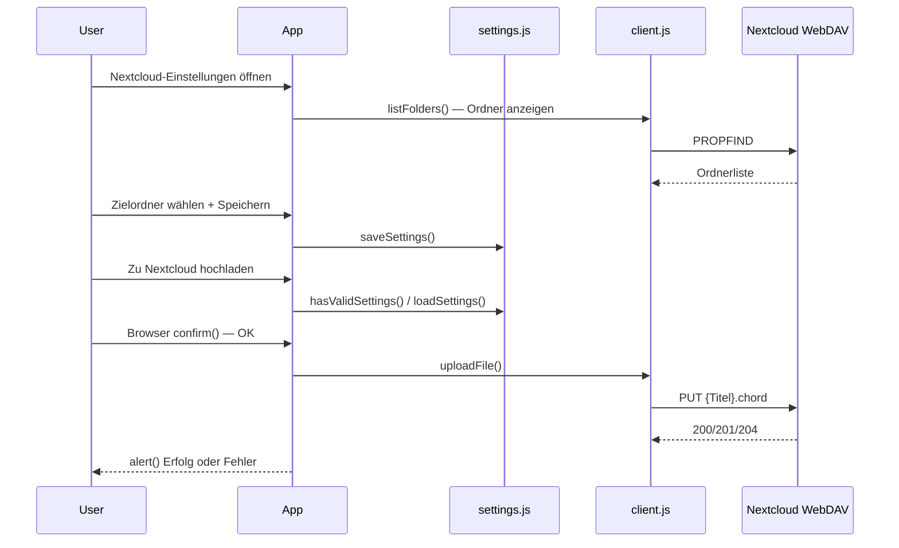
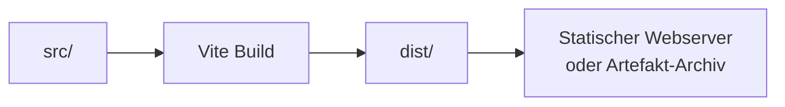
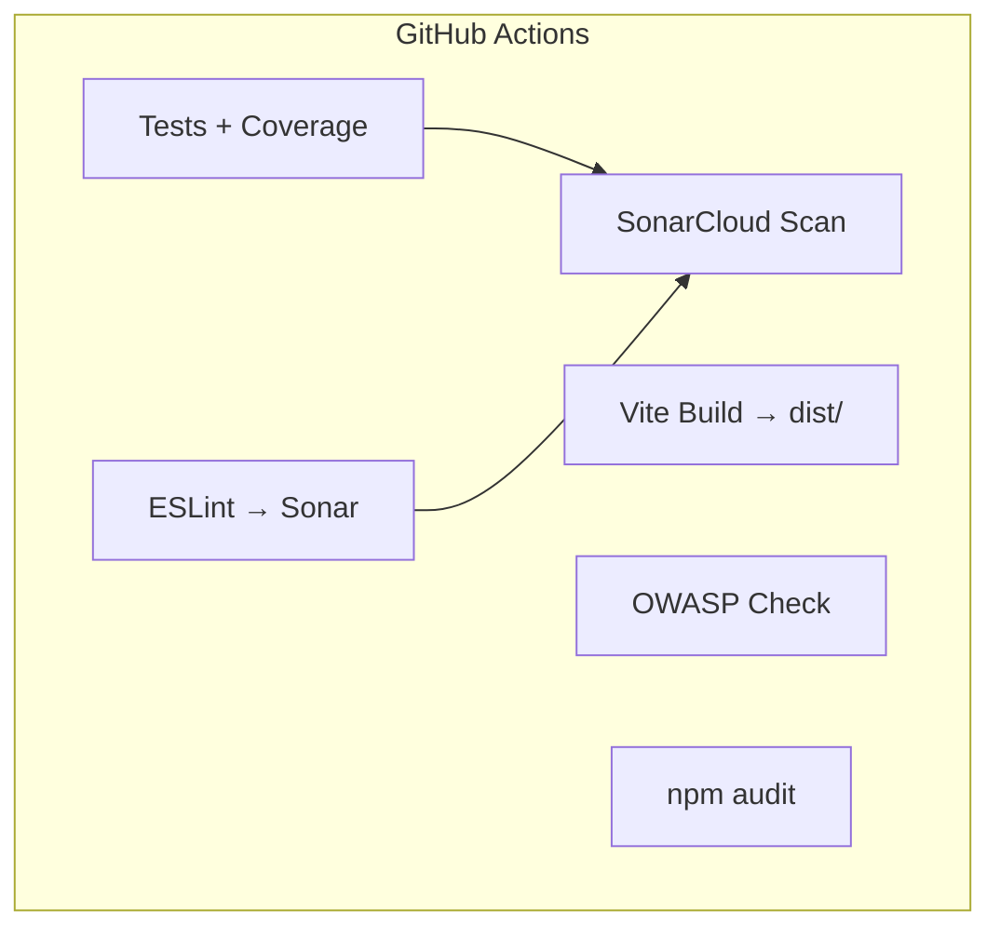

# Architektur

Dieses Dokument beschreibt den Aufbau des ChordPro Converters: Schichten, Datenfluss, Konvertierungslogik und die Integration in Build- und CI-Pipelines.

## Überblick

Der ChordPro Converter ist eine **Single-Page Application (SPA)** ohne Backend. Die gesamte Verarbeitung findet im Browser statt. Die Anwendung besteht aus drei logischen Schichten:

1. **Präsentationsschicht** — React-Komponenten für Eingabe, Aktionen und Ausgabe
2. **Konvertierungsschicht** — Reine JavaScript-Module ohne Framework-Abhängigkeit
3. **Integrationsschicht** — Optionaler WebDAV-Upload nach Nextcloud



## Technologie-Stack

| Schicht | Technologie | Rolle |
|---------|-------------|-------|
| Laufzeit | React 19 | UI-Rendering, lokaler State |
| Build | Vite 8 | Dev-Server, Bundling, HMR |
| Styling | Bootstrap 5 / React Bootstrap | Layout, Formulare, Buttons |
| HTTP | Axios | WebDAV-Upload |
| Tests | Vitest | Unit- und Integrationstests |
| Qualität | ESLint, SonarCloud, OWASP Dependency-Check | Statische Analyse und Sicherheitsprüfung |

## Verzeichnisstruktur und Verantwortlichkeiten

```
src/
├── main.jsx                      # Einstiegspunkt, Bootstrap-CSS, React-Root
├── App.jsx                       # Orchestrierung: State, Aktionen, Layout
├── components/                   # Präsentationskomponenten (stateless)
│   ├── InputFields.jsx           # Metadaten-Felder
│   ├── TextArea.jsx              # Monospace-Textareas
│   ├── ButtonGroup.jsx           # Aktionen inkl. Nextcloud-Upload
│   └── NextcloudSettingsModal.jsx # Credentials + Zielordner
├── converter/                    # Geschäftslogik (framework-agnostisch)
│   ├── convertToChordPro.js      # Hauptalgorithmus
│   ├── chords.js                 # Akkorderkennung
│   └── sections.js               # Abschnitts-Parsing
└── nextcloud/                    # Nextcloud-Integration
    ├── client.js                 # WebDAV PROPFIND + PUT
    └── settings.js               # localStorage-Persistenz
```

Die Konverter-Module unter `src/converter/` sind bewusst von React entkoppelt. Sie können unabhängig getestet und theoretisch auch in anderen Kontexten (CLI, API) wiederverwendet werden.

## UI-Schicht

### Einstieg (`main.jsx`)

`main.jsx` mountet die App in `#root`, aktiviert `React.StrictMode` und lädt das Bootstrap-Stylesheet global.

### Hauptkomponente (`App.jsx`)

`App.jsx` ist die einzige Stateful-Komponente. Sie hält den gesamten Anwendungszustand in `useState`-Hooks:

| State | Zweck |
|-------|-------|
| `input` | Rohtext des Akkordblatts |
| `title`, `artist`, `capo`, `key` | ChordPro-Metadaten |
| `output` | Konvertiertes ChordPro-Ergebnis |

Vier Aktionen werden an Unterkomponenten weitergereicht:

- **`handleConvert`** — Ruft `convertToChordPro()` auf und schreibt das Ergebnis in `output`
- **`copyToClipboard`** — Nutzt die Browser-Clipboard-API
- **`downloadChordProFile`** — Erzeugt einen lokalen Blob-Download (`.chord`)
- **`handleNextcloudUpload`** — Prüft Einstellungen, Browser-`confirm()`, dann `uploadFile()` mit Alert-Feedback
- **`handleNextcloudSettings`** — Öffnet Nextcloud-Einstellungen-Modal
- **`handleClear`** — Setzt alle Eingabefelder und die Ausgabe zurück

### Präsentationskomponenten

Alle Komponenten unter `src/components/` sind **stateless**. Sie erhalten Werte und Callbacks ausschließlich über Props:

- `InputFields` — Zweispaltiges Formular (Titel/Interpret links, Capo/Tonart rechts)
- `TextArea` — Wiederverwendbare Textarea mit Monospace-Font und `white-space: pre`
- `ButtonGroup` — Aktionen: Umwandeln, Kopieren, Download, Nextcloud-Upload, Einstellungen, Löschen
- `NextcloudSettingsModal` — Server-URL, Credentials, Zielordner (Textfeld oder WebDAV-Ordnerliste mit Auswählen/Öffnen)

Es gibt keinen globalen State-Manager (kein Redux, kein Context). Der Umfang der Anwendung rechtfertigt lokalen Komponenten-State.

## Datenfluss bei der Konvertierung



## Konvertierungsschicht

### Modulabhängigkeiten



### `chords.js` — Akkorderkennung

Zentrale Aufgabe: Unterscheidung zwischen Akkordzeilen und Textzeilen.

- **`CHORD_LINE_RE`** — Regulärer Ausdruck, der eine ganze Zeile als Akkordzeile validiert
- Unterstützt deutsche Notation (`H`), Vorzeichen (`#`, `b`), Suffixe (`m7`, `D/F#`, `Cadd9`), Taktstriche (`|`)
- **`isChordLine(line)`** — Prüft, ob eine Zeile ausschließlich aus Akkord-Tokens und Leerzeichen besteht
- **`splitChordLinePreserveSpaces(line)`** — Zerlegt eine Akkordzeile unter Beibehaltung der Leerzeichen (wichtig für die Positionierung über dem Text)

### `sections.js` — Abschnittsüberschriften

Parst Zeilen im Format `[Label] optionaler Resttext` und mappt Labels auf ChordPro-Direktiven:

| Label-Muster | ChordPro-Direktive | Bedeutung |
|--------------|-------------------|-----------|
| `Chorus`, `Refrain` | `{soc: …}` | Start of Chorus |
| `Verse`, `Strophe`, `Vers` | `{sov: …}` | Start of Verse |
| Alle anderen | `{c: …}` | Kommentar / Abschnittsname |

Die Erkennung ist case-insensitive und berücksichtigt optionale Nummern (z. B. `[Verse 1]`).

### `convertToChordPro.js` — Hauptalgorithmus

Die Funktion `convertToChordPro({ title, artist, capo, key, input })` verarbeitet den Eingabetext zeilenweise:

1. **Header** — `headerDirectives()` erzeugt Metadaten-Zeilen mit Validierung (Capo 1–11, Tonart im Format `[A-GH][#b]?(m)?`)
2. **Zeilen-Loop** — Jede Zeile wird klassifiziert:
   - **Akkordzeile** → in `chordBuffer` puffern; bei mehreren aufeinanderfolgenden Akkordzeilen wird der vorherige Puffer als reine `[Akkord]`-Zeile ausgegeben
   - **Leerzeile** → gepufferte Akkordzeile flushen, Absatz beibehalten
   - **Abschnittslabel** → ChordPro-Direktive + optionaler Resttext
   - **Textzeile mit Puffer** → `mergeChordAndText()` positioniert `[Akkorde]` an den Leerzeichen-Offsets der darüberliegenden Akkordzeile
   - **Reiner Text** → unverändert übernehmen
3. **Sentinel** — Eine leere Dummy-Zeile am Ende stellt sicher, dass der letzte Akkordpuffer verarbeitet wird

Exportierte Hilfsfunktionen (`mergeChordAndText`, `formatChordOnlyLine`, `headerDirectives`) sind separat testbar.

## Integrationsschicht: Nextcloud-Upload

Die Module unter `src/nextcloud/` kapseln WebDAV-Zugriff und lokale Einstellungen:

| Modul | Aufgabe |
|-------|---------|
| `client.js` | WebDAV `PROPFIND` (Ordnerliste) und `PUT` (Datei-Upload) via Axios |
| `settings.js` | Credentials und Zielordner in `localStorage` speichern/laden |

- Ziel-URL: `{baseUrl}/remote.php/dav/files/{username}/{ordner}/{dateiname}`
- Authentifizierung: Basic Auth mit Benutzername + App-Passwort
- Content-Type: `text/plain`
- Dateiname: `{Titel}.chord` (Sonderzeichen werden ersetzt)



Der Upload ist vom lokalen Download entkoppelt. Bestätigung und Rückmeldung erfolgen über Browser-`confirm()` bzw. `alert()`.

> **Hinweis:** Credentials liegen im Browser-localStorage. Für höhere Sicherheit wäre ein Backend-Proxy denkbar (siehe Erweiterungspunkte). Details: [Nextcloud-Upload](nextcloud-upload.md).

## Build- und Deployment-Architektur



- **Entwicklung:** `vite` Dev-Server mit HMR auf Port 5173
- **Produktion:** `vite build` erzeugt statische Assets in `dist/`
- **Preview:** `vite preview` zum lokalen Testen des Builds
- **GitHub Actions** archiviert `dist/**` als Build-Artefakt

Es gibt keinen Server-Side-Rendering- oder API-Layer. Die SPA kann auf jedem statischen File-Host deployed werden.

## Testarchitektur

Tests liegen in `test/` und importieren direkt aus `src/converter/` — ohne React-Rendering.

| Testbereich | Getestete Funktionen |
|-------------|---------------------|
| Akkorderkennung | `isChordLine` — positive und negative Fälle |
| Zusammenführung | `mergeChordAndText` — Positions-Offsets |
| Akkord-only-Zeilen | `formatChordOnlyLine` |
| Header | `headerDirectives` — inkl. deutscher Tonart `H` |
| End-to-End | `convertToChordPro` — Abschnitte, Merges, mehrere Akkordzeilen |
| Nextcloud-Client | `buildDavUrl`, `parseFolderList`, `uploadFile`, `listFolders` |
| Nextcloud-Settings | `loadSettings`, `saveSettings`, `hasValidSettings` |
| UI-Integration | `App`, `ButtonGroup`, `NextcloudSettingsModal` |

Vitest-Konfiguration (`vitest.config.js`):

- **Reporter:** JUnit (`reports/tests/junit.xml`) für CI
- **Coverage:** v8-Provider, Ausgabe als LCOV, Cobertura und Clover unter `coverage/`

## CI/CD-Pipeline

GitHub Actions (`.github/workflows/ci.yml`) prüft bei Push/PR auf `main`/`master` Qualität und Sicherheit in zwei parallelen Jobs:

**Job `build-test-lint-sonar`:**

1. `npm ci` → Dependencies
2. `npm run test:ci` → Tests + Coverage (Artefakt: `tests-and-coverage`)
3. `npm run lint:sonar` → ESLint JSON-Report (Artefakt: `lint-report`)
4. `npm run build` → Produktions-Build (Artefakt: `dist`)
5. SonarCloud-Scan mit Coverage- und Lint-Reports

**Job `security-scan`:**

1. `npm ci` → Dependencies
2. `npm audit` → Abhängigkeitsprüfung, nicht blockierend (Artefakt: `npm-audit-report`)
3. `npm run owasp` → OWASP Dependency-Check (Artefakt: `owasp-dependency-check`)

OWASP-Reports liegen nach dem Lauf unter **Artifacts → `owasp-dependency-check`** in der Actions-Run-Ansicht; lokal unter `dependency-check-report/dependency-check-report.html`.



## Designentscheidungen

| Entscheidung | Begründung |
|--------------|------------|
| Konverter ohne React-Abhängigkeit | Testbarkeit, klare Trennung von UI und Logik |
| Lokaler State statt State-Manager | Geringe Komplexität, wenige State-Variablen |
| Zeilenbasierter Parser statt AST | Eingabeformat ist textbasiert und zeilenorientiert; einfacher und robuster |
| Reguläre Ausdrücke für Akkorde | Ausreichend für gängige Akkordnotationen; gut testbar |
| Client-seitiger Upload | Kein Backend nötig; Trade-off: Credentials in localStorage |
| Basic Auth mit App-Passwort | Nextcloud-Standard für WebDAV; sicherer als Hauptpasswort |
| Monospace-Textareas | Visuelle Ausrichtung von Akkordzeilen über Textzeilen |

## Erweiterungspunkte

Mögliche zukünftige Architekturänderungen, ohne den bestehenden Aufbau zu brechen:

- **Backend-Proxy** — Upload über einen Server, um Credentials aus dem Browser zu entfernen
- **CLI-Modul** — `src/converter/` ist bereits extrahiert und könnte als eigenständiges npm-Paket oder Node-CLI dienen
- **Datei-Import** — Drag & Drop oder File-Input in der UI-Schicht, Konvertierung bleibt unverändert
- **Vorschau-Rendering** — ChordPro-PDF/HTML-Vorschau als zusätzliche Komponente neben der Textausgabe
