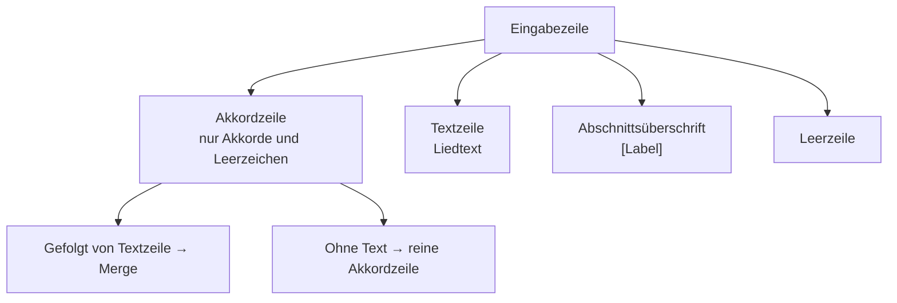

# Eingabeformat

Der ChordPro Converter ist ursprünglich dafür gedacht, **Akkordtabs von [Ultimate Guitar](https://www.ultimate-guitar.com/)** in das [ChordPro](https://www.chordpro.org/)-Format zu überführen. Die Anwendung erwartet kein fertiges ChordPro-Dokument, sondern **Rohtext im typischen Ultimate-Guitar-Tab-Layout**: Akkorde über dem Liedtext, Abschnitte in eckigen Klammern.

## Von Ultimate Guitar zum Converter

### Schritt 1: Tab auf Ultimate Guitar öffnen

Auf Ultimate Guitar sind Chords/Tabs im **Chord-Tab-Format** verfügbar — nicht das Instrumental-Tab (ASCII-Tabulatur mit Bundzahlen). Für diesen Converter wird die Variante mit **Akkordnamen über dem Liedtext** benötigt.

### Schritt 2: Metadaten notieren

Ultimate Guitar zeigt oben auf der Seite Angaben wie **Titel**, **Interpret**, **Capo** und **Tonart (Key)**. Diese werden im Converter in die Formularfelder eingetragen — sie sind **nicht** Teil des einzufügenden Tab-Textes.

| Ultimate Guitar | Feld im Converter | ChordPro-Ausgabe |
|-----------------|-------------------|------------------|
| Songtitel | Titel | `{title: …}` |
| Artist | Interpret | `{artist: …}` |
| Capo | Capo (1–11) | `{capo: …}` |
| Key | Tonart | `{key: …}` |

Gültige Tonarten: `C`, `Cm`, `F#`, `Bb`, `Am`, `H`, `Hm` usw. (deutsches **H** wird unterstützt).

### Schritt 3: Tab-Text kopieren

Den relevanten Tab-Bereich markieren und in die Zwischenablage kopieren. In das Eingabefeld gehört **nur der Liedinhalt** — keine Seiten-Navigation, keine Bewertungen, keine Kommentare, keine Strumming-Patterns oder Tuning-Hinweise.

Typischerweise ergibt sich beim Kopieren folgende Struktur:

```
[Verse 1]
D                    Am
Wenn man so will bist du das Ziel einer langen Reise
        C                           Em
die Perfektion der besten Art und Weise in stillen Momenten leise

[Chorus]
 D             Am                         C                     Em
Ich wollte dir nur mal eben sagen dass du das Größte für mich bist
```

### Schritt 4: Bereinigen (empfohlen)

Vor der Konvertierung sollten Ultimate-Guitar-spezifische Zusatzzeilen entfernt werden:

- Seitenkopfzeilen (`Title: …`, `Artist: …`, `Capo: …` im Text)
- Strumming-Pattern (`↓ ↓ ↑ …`)
- Tuning-Angaben (`Tuning: E A D G B E`)
- Kommentare und Anmerkungen des Tab-Autors
- Leerzeilen am Anfang und Ende übermäßig reduzieren (einzelne Absatz-Leerzeilen sind in Ordnung)

### Schritt 5: Konvertieren

Auf **Umwandeln** klicken. Das Ergebnis erscheint im Ausgabefeld und kann kopiert oder als `.chord`-Datei heruntergeladen werden.

### Schritt 6: Neues Lied konvertieren

Mit **Löschen** (rechts neben den anderen Buttons) werden alle Felder geleert — Metadaten, Eingabetext und ChordPro-Ausgabe. Danach kann ein neues Lied von vorne eingegeben werden.

## Grundaufbau des Eingabetextes

Der Eingabetext ist ein **zeilenbasierter Plaintext**. Jede Zeile hat genau eine Rolle:



### 1. Abschnittsüberschriften

Ultimate Guitar kennzeichnet Songabschnitte mit Labels in eckigen Klammern. Diese stehen **allein in einer Zeile**:

```
[Verse 1]
[Verse 2]
[Chorus]
[Bridge]
[Intro]
[Outro]
[Pre-Chorus]
[Solo]
[Refrain]
[Strophe 1]
```

**Zuordnung in ChordPro:**

| Ultimate-Guitar-Label (Anfang) | ChordPro-Direktive | Beispiel |
|-------------------------------|-------------------|----------|
| `Chorus`, `Refrain` | `{soc: …}` | `[Chorus]` → `{soc: Chorus}` |
| `Verse`, `Strophe`, `Vers` | `{sov: …}` | `[Verse 2]` → `{sov: Verse 2}` |
| Alle anderen (`Intro`, `Bridge`, `Solo`, …) | `{c: …}` | `[Intro]` → `{c: Intro}` |

Die Erkennung ist **case-insensitive** (`[chorus]` = `[Chorus]`). Nummern und Zusätze bleiben erhalten (`[Verse 1]`, `[Pre-Chorus]`).

Optional kann nach dem Label noch Text in derselben Zeile stehen:

```
[Verse 1] Erste Strophe hier
```

→ `{sov: Verse 1}` gefolgt von `Erste Strophe hier`

### 2. Akkordzeile + Textzeile (Hauptfall)

Das typische Ultimate-Guitar-Muster: **eine Zeile mit Akkorden direkt über der Liedtextzeile**.

```
E     H7    A
Keinen Tag soll es geben
```

Die Position der Akkorde wird über die **Leerzeichen-Offsets** der Akkordzeile auf den Text übertragen:

```chordpro
[E]     [H7]    [A]
Keinen Tag soll es geben
```

Wichtig:

- Die Akkordzeile muss **unmittelbar über** der Textzeile stehen (keine Leerzeile dazwischen).
- Die horizontale Ausrichtung aus Ultimate Guitar muss beim Kopieren erhalten bleiben — daher empfiehlt sich eine Monospace-Darstellung.
- Mehrere Akkorde werden durch Leerzeichen getrennt; die Anzahl der Leerzeichen bestimmt die Position im Text.

Komplexere Akkordfolgen werden unterstützt:

```
G   D/F#   Em7   |   Cadd9
Dass du sagen musst
```

Slash-Akkorde (`D/F#`), Erweiterungen (`Em7`, `Cadd9`) und Taktstriche (`|`) sind gültige Akkord-Tokens.

### 3. Reine Akkordzeilen (ohne Text)

Für Intros, Riffs oder Instrumentalpassagen ohne Liedtext — häufig bei Ultimate-Guitar-Tabs:

```
[Intro]
E  H7  A  E

G D C G
G D C G
G C D G
```

Verhalten:

- Steht eine Akkordzeile **ohne** folgende Textzeile vor einer Leerzeile, werden die Akkorde als eigene Zeile ausgegeben: `[E] [H7] [A] [E]`
- Mehrere aufeinanderfolgende Akkordzeilen ohne Text werden **jeweils einzeln** konvertiert (nicht zusammengeführt)

### 4. Reine Textzeilen (ohne Akkorde)

Textzeilen ohne darüberliegende Akkordzeile werden unverändert übernommen. Das kommt vor, wenn in einem Ultimate-Guitar-Tab nur die erste Zeile eines Abschnitts Akkorde hat:

```
[Verse 2]
D                     Am                            C
Wenn man so will bist du meine chill-out area meine Feiertage in jedem Jahr
      Em
meine Süßwarenabteilung im Supermarkt

die Lösung wenn mal was hakt so wertvoll das man es sich gerne auch spart
```

Hier wird `die Lösung wenn mal was hakt…` als reiner Text ohne Akkorde ausgegeben.

### 5. Leerzeilen

Leerzeilen trennen Absätze und Songabschnitte. Eine Leerzeile nach einer gepufferten Akkordzeile bewirkt, dass diese als reine Akkordzeile ausgegeben wird, gefolgt von einer Leerzeile im Ergebnis.

## Unterstützte Akkordnotation

Eine Zeile gilt als **Akkordzeile**, wenn sie ausschließlich aus Akkord-Tokens, Leerzeichen und optionalen Taktstrichen besteht.

| Element | Beispiele | Hinweis |
|---------|-----------|---------|
| Grundton | `C`, `D`, `E`, `F`, `G`, `A`, `B`, `H` | Deutsches **H** explizit unterstützt |
| Vorzeichen | `F#`, `Bb` | Optional |
| Moll | `Am`, `Em`, `Hm` | Suffix `m` |
| Erweiterungen | `Cadd9`, `H7`, `Em7`, `Dsus4` | Alphanumerische Suffixe |
| Slash-Akkorde | `D/F#`, `G/B` | Bassnote nach `/` |
| Klammern | `C(9)` | In Suffixen erlaubt |
| Taktstrich | `\|` | Als eigenständiges Token |

### Was keine Akkordzeile ist

Zeilen mit normalem Liedtext werden **nicht** als Akkordzeilen erkannt — auch wenn sie mit einem Akkord beginnen:

```
Em sieht man hier nicht am Anfang des Satzes   ← Textzeile, kein Akkord
This is just lyrics                             ← Textzeile
```

Ultimate Guitar zeigt manchmal Akkorde **inline am Zeilenanfang** im Liedtext. Dieses Format wird derzeit **nicht** automatisch erkannt. In solchen Fällen die Akkorde manuell in eine separate Zeile über den Text verschieben.

## Vollständiges Beispiel

### Eingabe (Ultimate-Guitar-Stil)

```
[Chorus]
E     H7    A
Keinen Tag soll es geben

[Verse 1]
G   D/F#   Em7   |   Cadd9
Dass du sagen musst

[Intro]
E  H7  A  E
```

Mit Metadaten: Titel *Friede Gottes*, Interpret *Trad.*, Capo *2*, Tonart *E*.

### Ausgabe (ChordPro)

```chordpro
{title: Friede Gottes}
{artist: Trad.}
{capo: 2}
{key: E}

{soc: Chorus}
[E]     [H7]    [A]
Keinen Tag soll es geben

{sov: Verse 1}
[G]   [D/F#]   [Em7]   |   [Cadd9]
Dass du sagen musst

{c: Intro}
[E] [H7] [A] [E]
```

## Bekannte Einschränkungen

| Situation | Verhalten |
|-----------|-----------|
| Akkorde inline im Liedtext (`EmWort…`) | Wird als Text behandelt, nicht konvertiert |
| Akkordzeile und Textzeile durch Leerzeile getrennt | Akkordzeile wird als reine `[Akkord]`-Zeile ausgegeben, Text separat |
| Ultimate-Guitar Chord-Pro-Export | Bereits ChordPro-formatiert — nicht erneut konvertieren |
| ASCII-Tabs (Bundzahlen) | Nicht unterstützt — nur Akkord-notation |
| Metadaten im Tab-Text | Werden nicht automatisch erkannt; Felder im Formular nutzen |
| Capo außerhalb 1–11 | Wird in der Ausgabe weggelassen |
| Ungültige Tonart | Wird in der Ausgabe weggelassen |

## Checkliste vor der Konvertierung

- [ ] Chord-Tab von Ultimate Guitar kopiert (kein ASCII-Tab)
- [ ] Titel, Interpret, Capo und Tonart in die Formularfelder eingetragen
- [ ] Zusatzinformationen (Tuning, Strumming, Kommentare) entfernt
- [ ] Abschnittslabels `[…]` stehen jeweils allein in einer Zeile
- [ ] Akkorde stehen in der Zeile **über** dem zugehörigen Text
- [ ] Horizontale Ausrichtung der Akkorde ist erhalten (Leerzeichen nicht zusammengezogen)
- [ ] Bei deutschen Liedern: `H` statt `B` verwenden, falls auf Ultimate Guitar `B` steht

## Siehe auch

- [Architektur](architecture.md) — Wie der Converter Eingabezeilen verarbeitet
- [README](../README.md) — Installation und Bedienung der Anwendung
